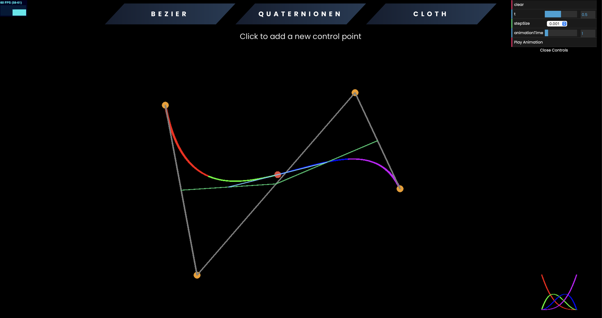
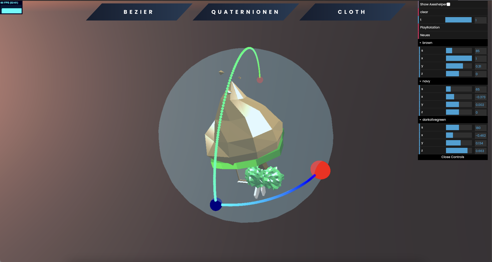
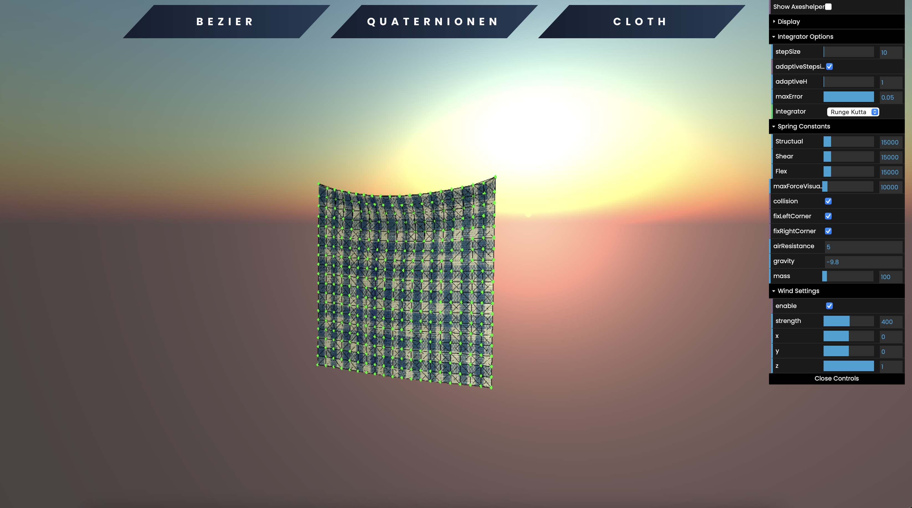

# Computergraphics Interpolation and Simulation

This project shows the Bézier curve, the quaternion rotation and the sequential execution of them. Furthermore, there is a particle simulation in the form of a cloth simulation using different integrators.

# Dev Setup

```
npm install
```

### to run the dev server

```
npm run serve
```

# Demo Screenshots

## Bezier:



## Quaternions:



## Cloth / Partical / Spring Simulation:


